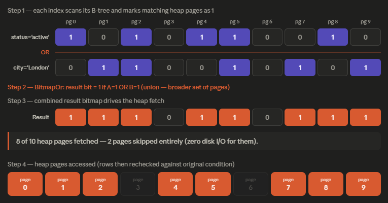
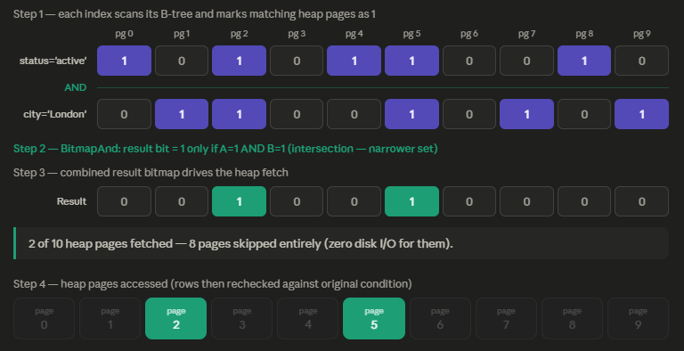

# General details

## Order of operations:
1. `FROM`
2. `WHERE`
3. `GROUP BY`
4. `HAVING`
5. `SELECT`
6. `DISTINCT`
7. `ORDER BY`
8. `LIMIT`

## IDENTITY vs SERIAL
* Both supports internal sequence of integers
* `SERIAL` is more like a preserved data type for the columns where identifiers should be generated (`id SERIAL PRIMARY KEY`).
* `IDENTITY` is more like auto-generated default value (`id BIGINT GENERATED BY DEFAULT AS IDENTITY`) or static value, e.g. not available to be stated from the user (`id BIGINT GENERATED ALWAYS AS IDENTITY`)
* Both `IDENTITY` and `SERIAL` columns are tracing internal sequence generated for them, they don't depend on last value inserted in that column (even after erasing table content entirely, iterator will continue from the last value from its internal sequence.)

## Aggregate functions:
* Aggregate functions for certain column don't take into consideration NULL values for the specified column (example: COUNT(name) will count only NOT NULL names)
* Aggregate functions to start taking into consideration NULL values use "*" instead of column name (example: COUNT(*) will count all the names)
* COUNT(DISTINCT age) will count only once some certain age value even if there are duplicate
* Aggregate functions can have expressions inside them: SELECT COUNT(price * 0.1) (expression has higher priority than aggregate function and will be executed firstly)

## HAVING vs WHERE:
* Filters out rows AFTER the `GROUP BY` was performed while WHERE do it before
* Can reference columns from the SELECT clause (Only in MySQL, not in PostgreSQL) while WHERE can reference all the table columns

## ROLLUP OPERATOR:
* Is used to summarize data for each group in GROUP BY clause (GROUP BY ROLLUP(column1, ...)). It applies only to the COLUMNS that aggregate values.

## Correlative subquery:
* Subquery (select statement used in another SQL statement) that is using data from the main query to gather different results at each iteration.

### Example: 
```sql
SELECT *
FROM invoices i 
WHERE i.invoice_total > (SELECT avg(i2.invoice_total) 
                         FROM invoices i2 
						 WHERE i2.client_id = i.client_id)
```

## EXISTS query:									
* Returns boolean result whether the result does have some rows or not
* No actual rows are returned, only true/false

## EXISTS vs IN:
* While IN returns a list of values which should be traversed and checked whether certain value falls into it (when millions of values are returned, the performance gets bad), the EXISTS query returns the direct answer (not so demanding as IN in most of the cases and has better performance)

## SQL collations:
* Collation - set of rules on how the character data to be compared and ordered. It can be set on the database level, column level and expression level (SELECT statement output)
* Collation setups the accent sensitivity (a, á), locale sensitivity (B and SS in Germany) and case sensitivity (A, a)
* `Collation "C"` is a case sensitive and accent sensitive. It's utilizing binary values of the characters and is comparing by raw numerical byte values (using ASCII table). Often called "binary collation".
  * Is usually faster than other collations like lexicographic/alphabetic. Is consistent through the platforms and OS's since relies on the internal binary value, not some external library provided like Glibc other collations use.

## COALESCE:
* Function that returns first NOT NULL value from the provided list of values OR NULL if no value satisfying the criteria was found
* All the values in the COALESCE function should be of the same data type at least in PostgreSQL is so (in MySQL string replacements can be provided if the column value is null)

### Example: 
```sql
SELECT COALESCE(NULL, NULL, 'test'); -- 'test'
SELECT COALESCE(NULL, NULL, NULL); -- NULL
```

## IF vs CASE:
* IF function exists in MySQL and can be used as if in programming: IF(condition, result)
* IF is not part of the PostgreSQL. CASE is replacing it
* `CASE` is like a **SWITCH** in programming

### CASE example:
```sql
CASE
    WHEN 1 THEN 1
    WHEN 2 THEN 2
    ELSE 3
END
```

## Other details:
* You can use `USING(<column_name>)` in INNER JOIN instead of specifying ON clause if you know that 2 tables does have columns with exactly equal <column_name>
* `CREATE TABLE AS SELECT` - only copies the column data type, column names and the actual data from the table (no constraints, no IDENTITY settings are getting copied)

<br>

# Views

## VIEW:
* Saved queries called VIEWs in order to simplify complex SQL expressions and limit access to the data that is being exposed. Limitation is being performed by the WHERE filtering.
* VIEW data can be accessed by simple SELECT statement just as standard table
* VIEW does not actually store the data. The data is stored by the table !

## Replacing existing view:
* It can be done only if you don't swap the columns and push back new columns. In case the order of columns is changed, then the view cannot be replaced with CREATE OR REPLACE. 
    * The view should be dropped and only then recreated

## Storing views/procedures/functions:
* It is better to save a view in the form of SQL file that and put that file under source control (like Flyway). This way all the changes made to the view/procedure/function will be tracked and easy to spot.

## Updatable view:
* Updatable view means a view that is literally an alias to the actual table - all the modifications performed with the view, will be also reflected on the table
* View, that doesn't have any: `JOIN`, `GROUP BY`, `HAVING`, aggregate functions, `DISTINCT`, `UNION`
* Such a view can be referred into `INSERT`, `UPDATE`, `DELETE` statements
* Sometimes you cannot have direct access to the table due to the security reasons and then manipulating the view is the last possible option to modify data

## Create view WITH CHECK OPTION:
* When you create a view, at the end of the query you can specify `WITH CHECK OPTION` that will ensure that further INSERT/UPDATE operations PERFORMED FROM THAT VIEW could not violate the defining query condition e.g. WHERE clause

## Benefits of the views:
1. Simplify or queries (instead of complex subqueries views can be reused simplifying the logic)
2. Reduce the impact of changes, abstraction over changes (in case we tie our microservice logic to the table, then renaming of the table/columns will lead to the code changes. If we perform all the operations via view utilizing it like a middleware, then we can control from the view script the flow: how the column is named or in case some columns were extracted to another table, then in the view we can still perform a JOIN with the new table and bring back these columns and BE/FE side will continue work like nothing had happened)
3. Restrict access to the table (using WHERE clause to exclude rows and columns by selecting only certain of them)

<br>

# Stored procedures

## Why it's not good to write SQL code directly in our application/microservice code:
1. Mix of Java and SQL looks messy
2. Languages like C# and Java require a compilation, so in case we need to change something in our SQL query, then the entire application should be recompiled and redeployed

## Stored procedure:
* It's a database object that contains a block of SQL code
* It's called in application code to store and retrieve data (MySQL) OR modify data (PostgreSQL)
* Database perform optimizations to the stored procedures and they sometimes can be executed faster
* Data security can be improved also, since we can declare what users can CALL the procedure

## Syntax:
```sql
CREATE PROCEDURE <name>(<optional parameters>)
BEGIN
    -- SQL code
END
```

### Example: 
```sql
CREATE PROCEDURE update_client (INTEGER client_id)
BEGIN
    UPDATE clients c
    SET salary = 50000
    WHERE c.client_id = client_id;
END
```

## Stored procedures - specifics:
1. Cannot return data like rows from the table compared to the function that can do it
2. Designed to handle logic/transactions, data update/data modification e.g. to have side effects

<br>

# Parameters

## PostgreSQL procedures/functions parameters - specifics:
1. When the name of the parameter is exactly the same as one of the table's columns with which you are interacting here, then there will be an error regarding ambiguous column names EVEN IF THE ALIAS for the queried table is used. So the accepted parameter should be prefixed with `_` for example.

###  No conflict: 
```sql
CREATE OR REPLACE PROCEDURE update_client (_client_id INTEGER)
LANGUAGE plpgsql
AS $$
BEGIN
    UPDATE clients
    SET name = 'Lukas'
    WHERE _client_id = client_id;
END; $$;
```

### ERROR:                
```sql
CREATE OR REPLACE PROCEDURE update_client (client_id INTEGER)
LANGUAGE plpgsql
AS $$
BEGIN
    PERFORM *
    FROM clients c
    WHERE c.client_id = client_id;
END; $$;
```

## Parameters validation:
* If the parameter is not in the expected format/range of values, then SQL exception can be raised (`SQLSTATE` code typically)
* Code for the `SQLSTATE` can be find on the web, since they are public
* Also HINT and `DETAIL` can be provided except ERRCODE
* `RAISE` clause is working ONLY in `BEGIN-END blocks`

### Types of messages that can be raise:
- debug
- log
- notice
- info
- warning
- exception

### Syntax for raising the exception:
```sql
RAISE EXCEPTION '<message>'
    USING ERRCODE = '<SQLSTATE code>',
        DETAIL = '<detail optional>',
        HINT = '<hint optional>';
```

## Output parameters:
* Parameter to which some specific value from the queries is written and that can be read afterwards
* The parameter should be some certain variable
* Reading/retrieving data this way is a bit more complex and hard than just using functions

### Syntax of output parameters:
```sql
OUT <parameter name> <parameter type>
```

<br>

# Variables

## Variable types:
* Local: bound to the function or stored procedure execution e.g. transaction scope of the BEGIN-END block and live till the execution continues. 
* Session: bound to the user connection e.g. session

<br>

# Functions

## Function:
* An SQL entity that can have returned value/be void and also have side effects

## Function syntax:
```sql
CREATE FUNCTION <name> (<optional parameters>)
RETURNS <data type, table or void>
LANGUAGE plpgsql
AS $$
BEGIN 
    -- SQL code
END; $$;
```

## Function - specifics:
* When returning a TABLE, then every column type of the returned table should be equal to the every column from the `RETURNS TABLE` declaration
    * If you declare `RETURNS TABLE(name TEXT)` and the query for that one retrieves `VARCHAR(50)`, then you will get an error even though `VARCHAR(50)` can be handled in `TEXT`

<br>

# Triggers

## Trigger:
* Block of SQL code that is executed `BEFORE`/`AFTER`/`INSTEAD OF` certain SQL operations: `DELETE`, `INSERT`, `UPDATE`. Execution is not explicit, it's automatic.

## Naming convention:
```sql
<table name>_<before/after>_<insert/update/delete>
```

### Example: 
```sql
CREATE OR REPLACE TRIGGER payments_after_insert
```

## Specifics:
1. Trigger can modify data in any table EXCEPT table it's created for (if you create trigger on table A, then you cannot modify A table in it)
    * Trigger will fire itself and infinite loop will happen, that's why it's not possible
2. In PostgreSQL a trigger cannot have inline block that will define the actions from the trigger. It can only execute certain function. This was done with idea of reusability of one function for the multiple triggers. Other languages like MySQL, Oracle do have inline `BEGIN-END blocks`.

## How to create a trigger in PostgreSQL:
1. You should have a function that returns `TRIGGER` as a type
2. Trigger should EXECUTE that function

## Syntax:
```sql
CREATE [ OR REPLACE ] TRIGGER name { BEFORE | AFTER | INSTEAD OF } {INSERT | UPDATE | DELETE | TRUNCATE OR INSERT | UPDATE | DELETE | TRUNCATE ... }
ON table_name
[ FOR EACH { ROW | STATEMENT } ]
[ WHEN ( condition ) ]
EXECUTE { FUNCTION | PROCEDURE } function_name ( arguments )
```

## Function returning trigger - return types explained:

### In BEFORE triggers: 
* The return value controls what gets written to the table, so it matters:
    * For `INSERT`/`UPDATE` → return `NEW` because that's the row about to be saved
    * For `DELETE` → return `OLD` because that's the row about to be removed
    * Return **NULL** in either case &rarr; cancels the operation

### In AFTER triggers: 
* The operation is already done, so the return value is completely ignored 
    * you can return NEW, OLD, or NULL and nothing changes

## For each row VS for each statement:
* `FOR EACH ROW` trigger: is being executed per each row affected. 50 rows updated, then 50 calls of the trigger.
* `FOR EACH STATEMENT` trigger: is being executed per each statement. 50 rows updated, only 1 execution.

<br>

# Transactions

## Transaction:
* Representation of single unit of work (bank transaction: if you transfer 10$ from your account to you friend's account, then this 2 actions should happen either both or none)
* We need transactions when we have multiple statements that we want to fail or succeed TOGETHER AS A SIGNLE UNIT
* If transaction cannot finish successfully, then all changes made until the moment of exception will be rolled back

## ACID properties:
1. **Atomicity** (transactions are like atoms: cannot be divided any more. Each transaction is a single unit of work no matter how many statements it contains. Either all succeed or nothing.)
2. **Consistency** (DB will always retain consistent. There never will be an order without client_id)
3. **Isolation** (each transaction is separated from others with its context. If multiple transactions are trying to modify the same data, then this data/rows are being locked allowing only one transaction at a time to modify them while others will wait)
4. **Durability** (once a transactions is committed, then changes made by transaction are persisted/permanent)

## Transactions - specific detail:
* Every single statement like `INSERT`, `UPDATE`, `DELETE` is wrapped into the transaction and it's COMMITTED in case the statement didn't return an error (that is auto commit mode and it's a default behavior in PostgreSQL)
* Auto commit is a system variable and the above process is controlled by it
### Example: 
```sql
INSERT INTO employees (id, name, salary)
VALUES (1, 'Alice', 5000),   -- ✅ OK
       (2, 'Bob',   6000),   -- ✅ OK
       (3, 'Carol', 'oops'), -- ❌ ERROR: invalid input for numeric
       (4, 'Dave',  7000);   -- never reached
```

## Transaction finalization:
* `COMMIT`: to apply all the changes made
* `ROLLBACK`: to discard all the changes made. Can be used when some certain exception was caught and to be the part of business logic

## Concurrency:
* Multiple entities are accessing one resource at the same time (one user modifies the data the other is trying to retrieve)
* If multiple transactions are trying to modify the same rows, then these rows are being locked and allowed to access only by one at a time transactions while others will wait until `COMMIT`/`ROLLBACK` of the previous one (default behavior)

## Concurrency problems (transaction anomalies*):
1. **Lost updates** (2 transactions try to update the same data and the locking mechanism is not used, thus transactions are not isolated properly)
    * Transactions that commits later overwrites changes made by the previous transaction if we are talking about update of the same columns
2. **Dirty read** (transaction reads data that HAS NOT BEEN COMMITED yet)
    * One transaction updated some column but the changes are not yet committed, however another transaction have read changes that can be ROLLBACK and then the second transaction will operate above data that is not existing at all
3. **Non-repeatable read** (transaction reads the same data multiple times and gets different result since the data was changed and saved between these reads)
4. **Phantom read** (transaction do not update all the data following the criteria since this data was updated, deleted, added after the transaction made an update)

## Transaction isolation:
1. `READ_UNCOMMITTED` (no isolation at all. Transaction can read each other data that is not yet committed and saved)
    * Prevents Lost updates
2. `READ_COMMITTED` (transactions can read only the data that is committed)
    * Prevents Dirty read but still non-repeatable read can happen
3. `REPEATABLE_READ` (consequent data retrievement within one transaction are the same as the first one no matter how the queried data was changed by other transactions. Basically all the data manipulations are dealing with some sort of snapshot of the data made before transaction begun)
    * Prevents non-repeatable read, but still phantom read can happen (since every read is repeatable in that case and other transaction can change data with the same criteria and the changes won't reflected in that transaction, only in the next one)
4. `SERIALIZABLE` (one transaction is aware of other transactions' operations that can change the data it's going to manipulate, thus it's waiting for another transaction to finish and only after that operate on the whole set/finalized set of data FOR SURE)

## Transaction isolation - specifics:
* The more we increase isolation level, the more concurrency and performance problems we are going to face but the less anomalies we are going to face (because we are basically reducing the concurrency)
* The lower level of isolation is set, the more users can access the higher is level of the concurrency but bigger risk of anomalies
* Transaction isolated is basically delivered and guaranteed with locks and wait mechanisms

## Deadlock:
* The situation when one transaction is waiting for another and another one is waiting for the current one

<br>

# Data types

## Data types categories:
* String types
* Numeric types
* Data and time types
* Boolean type
* Enum type
* JSON type
* Blob types (binary)
* Spatial types (geometrical, geographical)

### String types:
* CHAR (...) => fixed length. The entire length is always filled and when content is < length, then (length - content) is filled with spaces 
* VARCHAR (...) => variable length. Only those positions that needed will be filled with content | 64kb MAX
* TEXT => native to the PostgreSQL and to some other SQL languages, isn't part of the standard. Allows to store string values of any length
* If CHAR and VARCHAR are used without length specification, then they can store any amount of symbols
* Bytes: English symbol (1 byte), Easter Europe (2 bytes), Asia (3 bytes); CHAR(10) = 30 bytes (in case of Asia locale)

### Integer types (Store whole numbers without decimal point):
* `TINYINT` [-128, 127]
* `UNSIGNED TINYINT` [0, 255]
* `SMALLINT` - 2 bytes [-32K, 32K]
* `INT` - 4 bytes [-2B, 2B]
* `BIGINT` - 8 bytes [-9Z, 9Z]; Z - 18 zeros, quintillion

### Floating point types:
* `DECIMAL` (precision, scale): DECIMAL(9, 2) => 1234567.89 (maximum 9 digits and 2 digits after the floating point)
* `NUMERIC` - same as DECIMAL
* `FLOAT` - less precise than double
* `DOUBLE` - more precise than float
* `DECIMAL` is often used for monetary manipulations where the precision is critical

### Enum type:
* Accepts only certain text values
* Disadvantages: changing/renaming the members of Enum can be expensive (the entire table will be rebuilt); limited functionality, cannot add additional fields; it's quite problematic to query all the possible Enum column values
* Better approach is to use Enum in BE app or to use a separate table that will define allowed sizes and holding `FK` to it

#### Example:
```sql
ENUM('M', 'L', 'XL')
```

### Date & time types:
* DATE
* TIME (with and without timezone)
* TIMESTAMP (with and without timezone) - data + time
* INTERVAL - represents not a timestamp, but an interval in time

#### Example: 
```sql
INTERVAL '1 year 2 months 3 days 4 hours 5 minutes 6 seconds
```

### Blobs:
* Binary large objects
* Is used to store images, videos, PDFs, Word files
* Performance problems: increased size of the DB, slower retrievement compared to the hard drive read, additional code to read/write to DB

### JSON type:
* JavaScript object notation
* Is used when you need flexible/optional properties structure
* Certain JSON field can be indexed instead of the entire column
* Allowed data types inside it: 
  1. **number** => {"age": 15} 
  2. **string** => {"name": "Mark"}
  3. **Boolean** => {"isSelected": true}
  4. **array** => {"status": ["first", "second"]}
  5. **object** => {"state": {"capital": "Test", "government": "Test"}}
  6. **null** => {"name": null}

### JSON vs JSONB:
1. Storage: JSON is a row text while JSONB is a decomposed binary format
2. Input speed: JSON is faster (just stored the text) while JSONB is slower (parses + converts)
3. Query speed: JSON is slower (re-parses every time) while JSONB is significantly faster (pre-parsed)
4. Indexing: JSON is limited while JSONB allows full GIN indexing
5. Duplicate keys: JSON allows duplicate keys while JSON only stores the last key-value pair !
6. Formatting: JSON preserves key order initial and whitespace while JSONB doesn't preserver key-order and strip white spaces

<br>

# Designing database

## Modeling the database:
1. Understand the requirements
2. Conceptual model (connections and entities on the abstract level: represents entities and their relationships)
3. Logical model (just tables and connections, no SQL dialect specifics)
4. Physical (implementation of the logical model in some certain SQL dialect)

> Express visually concepts: ER(Entity relationships) diagram, UML

## Models evolution:
> Conceptual &rarr; logical &rarr; physical

## Conceptual model:
* High level overwiew of the business domain as well as roles in this domain: no implementation specific information so far as data types, field constraints, etc.; DBMS agnostic at that stage
* Doesn't give a structure to store the data, just models business concepts
* Is used to communicate with domain experts


## Logical model:
* No SQL dialect specific details, even though data types of the fields should be stated
* Adds more details to the conceptual model: what structure should we have, what tables should exist


### Example: 
| Customer |
| :--- |
| name (string) |

> "string" instead of `varchar` since the last one is SQL specific

## Physical model:
* The most precise model that literally correlates with the data structure and how it will be saved
* Is valid for some SQL dialect


## Table relationships:
* **One-to-one**
* **One-to-many**
* **Many-to-many** (requires **Join table** to be modeled)
  * Endings: parent ending (the one with `PK`), child ending (the one with `FK`)

>  In relational databases we only have `One-to-one` and `One-to-many` relations. Other are simulated

## Primary key:
* Column that uniquely identies the row in the table (unique identifier)
* Composite `PK`: primary key consisting from multiple columns/fields
* Should be designed the way the initial value is not changing and stays forever*
* To auto-generate PK values on insert use `SERIAL` as data type (legacy) OR `GENERATED ALWAYS AS IDENTITY`

## Foreign key:
* A column that connect 2 tables: it's referencing a PK of another table.
* Foreign key name should be unique across the DB

### Syntax: 
```sql
fk_<child table>_<parent table>
```

### Foreign key constraints:
1. `NO ACTION`: is giving error if the child rows exists and parent rows with respective PK is going to be deleted
2. `RESTRICT`: same as NO ACTION
3. `CASCADE`: is updating/deleting child rows in case parent row was changed/deleted
4. `SET NULL`: sets NULL value to the FK in case of update/delete of the parent row (generally is a bad practice since it'll lead to orphan records and there won't be clear what is the parent row of this child row)

### Most common practice regarding FK constraints:
1. `UPDATE`:
```sql
CASCADE ON UPDATE
```

2. `DELETE`:
```sql
RESTRICT ON DELETE;
CASCADE ON DELETE; -- not so preferable  
```

<br>

# Common table expression (CTE)

## CTE
* Temporary result set (result of some query) inside the main query
* Is used to improve readability, to reduce complexity of big queries and detailed filtering
* Allows to break into different parts a complex query
* This temporary result sets can be reused inside the query this way reducing code duplication

## Syntax:
```sql
-- If parameters not specified, then result column names will be inherited from the actual query after AS keywoard
WITH cte_name (column1, column2, ...) AS (
    -- CTE query
    SELECT ...
)

-- Main query using the CTE
SELECT ...
FROM cte_name;
```

<br>

# Normalization

## Normalization
* It's a process of reviewing DB design and ensuring that it's following certain rules preventing data duplication, inconsistencies 
* There are 7 rules and each consecutive assumes that each preceding it is applied already. In most cases, we only need 3 first rules &rarr; **3 normal forms**

## 1-st normal form
* Each cell in the row should have **only single value**
* We **cannot** have repeated columns

### Example:
| courses |
| :--- |
| course_id INT |
| title VARCHAR(255) |
| price DECIMAL(5, 2) |
| instructor VARCHAR(255) |
| `tags VARCHAR(255)` |

#### Problem:
> The problem is with the column `tags` since there can be a lot of values in it and they can be pretty diffucult to work with separately/in filtering

#### Solution:
> Solution is to extract `tags` as to a separate table and connect these tables via `Many-to-many` connection

## Join tables:
* A table that hold `FK` to multiple other tables and behaves like a bridge between them
* Modules actually a `Many-to-many` relationships
* `PK` of the Join table can be either independent identifier OR can be composed of FK's of the referencing tables
    * Second approach advantage: this way we will guarantee that no duplicate connections between tables exists
    * Second approach problem: if more tables are added to the Join table, then `PK` should be dropped + rebuilt (not a good idea)
  
## 2-nd normal form
* `1-st normal form` is fulfiled
* Every table should describe **only one entity**
* Every column of that table should describe **exactly one single entity**

## 3-rd normal form
* `2-nd normal form` is fulfiled
* Within one table one column shouldn't depend on other(s) OR a column in a table should not be derived from other columns

## Tips to retain normalization
1. There is no need to `learn by heart` this normalization rules, just look for the duplications and data that is not related to the place, where it's saving (column should be extracted in another table)
2. Do not apply normalizations blindly for each table. Just think about logical entities and their relationships
   * Suppose that we have table `customer` and it has column `address`. At some point of time each customer can have **multiple** addresses. Then with this design there will be duplicated records of the same customer to assign one more address to him
   * The correct solution is to extract column `address` to another table `addresses` and connect `customer` and `addresses` with `FK`
3. If values in the table repeats and these values `are not FK's` &rarr; then this table is not normalized
4. Do not jump right into creating tables, first try to model the relationships

## Tips for the DB modeling
> Do not model the universe
* Try to satisfy current and only viable future requirements. Do not try to avoid every each problem/conflict and make you database too abstract without the actual need of this complexity
* Most of the "future requirements" that we are trying to satisfy and predict are not even possible/realistic and do not even faced. So, too much time and efforts spent without the need and basically for worse since the design is overcomplicated

# Storage engines

## Storage engine
* Determines how the data is stored
* Determines  what the features are available to us: like `transactions`

### Example in MySQL
```sql
SHOW ENGINES;

-- Most common engines:
-- Engine
-- ...
-- MyIsam
-- ...
-- InnoDB

-- MyIsam: more old engine
-- InnoDB: supports all modern features like transactions. The default one for MySQL
```

# Indexes

## Index
* A structure that optimizes DB queries by storing some columns' values in effective data structure
* Indexes often are compared with **dictionaries** or **phone books**: data is organized, sorted and thus there is no need to traverse every each row
* In most of the cases indexes are small enough to fit in the `memory`. Reading from the memory is much faster than reading from the `disk` directly and traversing the entire table
* Indexes can improve performance of sorting operations (when columns in `ORDER BY` are part of the `composite index`)

## Syntax
```sql
CREATE INDEX idx_<column targeted> ON <table name>([<column 1>, ...])
```

## Cost of indexes
1. Increase the database size
    * Since should be stored along with the table where they belong
2. Slow down writes
    * At each `UPDATE`/`INSERT`/`DELETE` the index should be **actualised** automatically by the SQL and therefore these operations are slowed down slightly*

## Tips for indexes
* Not each column in each table should be indexed, they should be used **only** for:
    1. Performance critical queries
    2. Frequently executed queries
    3. Should be added when data in that particular column **is not changing too frequently**
* Design indexes **based on the queries**, not **based on the tables**

## Index types on internal structure and purpose
1. **Binary tree**
    * The most common index representation and is the default one while creating an index
    * Is using `Balanced Binary Tree` where all the keys are sorted in some way
    * Is used for sorting (`ORDER BY`) and also handles operations `=`/`>`/`<` just fine

    ### Syntax
    ```sql
    CREATE INDEX index_name
    ON table_name (indexed_column);
    ```
2. **BRIN**
    * BRIN - block range index
    * Similar indexes as `Binary Tree` but occupies the less memory and therefore can be used for **much bigger tables**, where `Binary Tree` would reach overflow for example
    * Is suitable only for sequential data: column of type SERIAL, auto-generated date of record insertion (`created_at` column). The most important column to have some `order`
    * Instead of indexing every single row, a BRIN index groups physical pages of the table into "blocks" and simply records the minimum and maximum values for each block
    
    ### How it works
    * If you query for a specific value, PostgreSQL checks the BRIN index: "Is the value I'm looking for between the min and max of Block 1? No. Block 2? Yes." It then scans only Block 2

    ### Syntax
    ```sql
    CREATE INDEX idx_brin_timestamp 
    ON your_table_name USING brin (created_at);
    ```

3. **Hash**
    * Is used only for the **equality comparison** e.g. operation `=`, otherwise cannot be utilized. So no range queries like `<`, `>`
    * Instead of **self-balance Binary Tree** is using **Hash table**
    
    ### Syntax
    ```sql
    CREATE INDEX index_name
    ON table_name USING HASH (indexed_column);
    ```

4. **GIN**
    * GIN - generalized inverted index
    * Are used when in a single column you have **multiple values** stored: `jsonb`, `json`, `array`, `tsvector`
    * There are 2 types of this index:
        * jsonb_ops (**default one**)
            * Indexes every **key** and **value** of the json/jsnob column independently
            * **Usage**: situations when you need to check the existence of any key on any hierarchy level **without specifying it's value**
            
            ### Syntax
            ```sql
            CREATE INDEX idx_your_index_name 
            ON your_table_name USING GIN (your_jsonb_column);
            ```
        * jsonb_path_ops
            * Indexes every **key** and **value** in the same structure, not separately e.g. as pairs
            * Is faster and more light-weight than the `jsonb_ops`
            * Is preferable in most cases **unless you need to check on existence the keys without specifying the value for this pair** (e.g. operator `?`)
            * Can search only for the full `JSON` format **key-value pairs**, not the keys/values separately

            ### Syntax
            ```sql
            CREATE INDEX idx_your_index_name 
            ON your_table_name USING GIN (your_jsonb_column jsonb_path_ops);
            ```
    * Specifics:    
        * In case you want to index only a **certain key** from the entire `jsonb` column, you don't need to use a `GIN` index. You can use a simple `Binary tree` index and the key value will be indexed as text
        * The entire indexed expression should also be wrapped in `()` additionally
        
        ### Syntax
        ```sql
        CREATE INDEX idx_specific_json_field 
        ON your_table_name ((your_jsonb_column->>'email_address'));
        ```
        
5. **GIST**
    * GIST - generalized search tree
    * Not a single index type, but instead is an **indexing framework** that lets you define custom indexing structure for the predefined data types and operators
    * Are used when some **complex structures** should be indexed: `geometries`/spatial types, text search vectors (`tsvectors`), `ranges`. When used for the simple data types will be less performant compared to the basic `Binary Tree` index
    * Used data structure is `Binary Tree`
    * While the `tsvector` column can be indexed both via `GIST` and `GIN`, the `GIST` index will be smaller but less effective 
    
    ### Representation of the index
    ```
             [covers Europe]
            /               \
      [covers France]   [covers Germany]
        /       \           /      \
    [Paris]   [Lyon]    [Berlin]  [Munich]
    ```

    ### Syntax
    ```sql
    CREATE INDEX idx_geom ON places USING GIST (location);

    -- Example of the query itilizing the index
    SELECT name FROM places
    WHERE location && ST_MakeEnvelope(23.2, 42.5, 23.5, 42.8, 4326);
    ```

### Example

#### Customers
| first_name | last_name | state |
| :--- | :--- | :--- |
| ... | ... | CA |
| ... | ... | NY |
| ... | ... | FD |
| ... | ... | VA |
| ... | ... | CA |


#### Index
* Not exact representation of the `index`, more for the demo purpose 

| state | pointer_row |
| :--- | :--- | 
| CA | 1 |
| CA | 5 |
| FD | 3 |
| NY | 2 |
| VA | 4 |

## `Clustered` index vs `non-clustered` index
> These concepts exits only for the MS SQL Server DBMS and SQL dialect. PostgreSQL, MySQL, Oracle still do have only `heap` structure and `non-clustered indexes`

### Clustered index
* `Clustered index` determines the **physical order** of data in a table. The rows are stored on disk in the same order as the index
* Only one per table (since data can only be physically sorted one way)
* A table without `Clustered index` is called `heap`
* The index is the table — the **leaf nodes** contain the actual data rows
* By default, the `Primary Key` creates a clustered index
* Lookups are very fast because once the index finds the row, the data is right there


### Non-clustered index
* `Non-clustered index` is a separate structure from the table data. Its **leaf nodes** contain the index key plus a pointer (**row locator**) back to the actual data row.
* Does not affect physical storage order
* Is a **default type** when creating an index
* Requires an extra lookup step (pointer &rarr; data row), called a **key lookup**
* Great for columns frequently used in `WHERE`, `JOIN`, or `ORDER BY` clauses


* When is created in the table with defined `Clustered index`, then every search via non-clustered index will find data records not immediately via `RID`, but instead will do a key-lookup via clustered index column from the start of the tree
    * Instead of `RID` the index node holds the value of the key attribute of the clustered index

#### RID lookup


#### Key lookup


## Composite (multicolumn) index

### Composite index
* Composite or multicolumn index is an index that covers multiple columns in its structure in a **defined order**
* In reality should be used more often than just single indexes since real queries often have multiple filters that are handled better with **composite indexes**

### How it works internally
```sql
CREATE INDEX idx_state_points ON customers(state, points);    
```

#### Above index will be represented in memory in the following way

| state | points |
| :--- | :--- |
| CO | 1400|
| CO | 900 |
| ... | ... |
| CA | 2500 |
| CA | 1500 |
| CA | 600 |

#### An the index will be used in the following query
```sql
SELECT first_name, last_name
FROM customers
WHERE state = 'CA'
    AND points > 1400;

-- Bitmap Heap Scan on customers  (cost=4.98..32.02 rows=69 width=15) (actual time=0.026..0.048 rows=71.00 loops=1)
--   Recheck Cond: ((state = 'CA'::bpchar) AND (points > 1400))
--   Heap Blocks: exact=23
--   Buffers: shared hit=25
--   ->  Bitmap Index Scan on idx_state_points  (cost=0.00..4.97 rows=69 width=0) (actual time=0.017..0.017 rows=71.00 loops=1)
--         Index Cond: ((state = 'CA'::bpchar) AND (points > 1400))
--         Index Searches: 1
--         Buffers: shared hit=2
-- Planning Time: 0.072 ms
-- Execution Time: 0.061 ms

-- Without index
-- Seq Scan on customers  (cost=0.00..56.16 rows=69 width=15) (actual time=0.007..0.110 rows=71.00 loops=1)
--   Filter: ((points > 1400) AND (state = 'CA'::bpchar))
--   Rows Removed by Filter: 1940
--   Buffers: shared hit=26
-- Planning:
--   Buffers: shared hit=5
-- Planning Time: 0.068 ms
-- Execution Time: 0.120 ms
```

### Utilization specifics
1. When **left-most columns** from the index are used in query, then the probability of index utilization is higher

    #### Example
    ```sql
    CREATE INDEX idx_orders_multi 
    ON orders (customer_id, order_date, product_id, region, payment_status, created_at);
    ```
    > This index covers six columns, and is **most effective** when queries filter starting from `customer_id`, then `order_date`, and so on

### Order of columns in `composite index`
1. Most frequently used columns should come first in index
2. Columns with the higher cardinality should come first
    * **Cardinality** - number of unique values

    #### Example
    1. Lets say that we do have column `gender` which values can be only **M** and **F**
        * Suppose that there are **1 millions records in the table** and if we have `even distribution` of values in this column, then we will have 1/2 million of **M** and 1/2 million of **F**
        * If this column is indexed, then our search on with this index can narrow down to **500K** from 1 million

        | gender |
        | :--- |
        | M |
        | M |
        | ... |
        | F |
        | F |
        | F |

    2. Lets say that we do have column `state` which values can have 48 different values
        * Again suppose that there are **1 millions records in the table** and if we have `even distribution` of values in this column, then we will have 1 million / 48 = 20K records for each values of the `state` column
        * If this column is indexed, then our search on with this index can narrow down to **20K** from 1 million

        | state |
        | :--- |
        | CA |
        | CA |
        | ... |
        | CO |
        | CO |
        | CO |
        
    > Examples shows, that indexing of the `state` column is a way more profitable for the queries

3. We should always pay attention on the **queries**, not only on the **cardinality**. We should think first how the actual query will be executed using indexes

    #### Example
    ```sql
    EXPLAIN ANALYZE SELECT customer_id
    FROM customers c
    WHERE state = 'CA' AND last_name LIKE 'A%';

    -- No index
    --Seq Scan on customers c  (cost=0.00..56.16 rows=9 width=4) (actual time=0.022..0.113 rows=14.00 loops=1)
    --  Filter: (((last_name)::text ~~ 'A%'::text) AND (state = 'CA'::bpchar))
    --  Rows Removed by Filter: 1997
    --  Buffers: shared hit=26
    --Planning Time: 0.068 ms
    --Execution Time: 0.123 ms

    CREATE INDEX idx_state_last_name ON customers(state, last_name);

    EXPLAIN ANALYZE SELECT customer_id
    FROM customers c
    WHERE state = 'CA' AND last_name LIKE 'A%';

    --Bitmap Heap Scan on customers c  (cost=5.95..35.30 rows=9 width=4) (actual time=0.032..0.065 rows=14.00 loops=1)
    --  Recheck Cond: (state = 'CA'::bpchar)
    --  Filter: ((last_name)::text ~~ 'A%'::text)
    --  Rows Removed by Filter: 209
    --  Heap Blocks: exact=26
    --  Buffers: shared hit=28
    --  ->  Bitmap Index Scan on idx_state_last_name  (cost=0.00..5.95 rows=223 width=0) (actual time=0.018..0.018 rows=223.00 loops=1)
    --        Index Cond: (state = 'CA'::bpchar)
    --        Index Searches: 1
    --        Buffers: shared hit=2
    --Planning Time: 0.075 ms
    --Execution Time: 0.076 ms

    CREATE INDEX idx_state_last_name ON customers(state, last_name) INCLUDE (customer_id);

    EXPLAIN ANALYZE SELECT customer_id
    FROM customers c
    WHERE state = 'CA' AND last_name LIKE 'A%';

    --Index Only Scan using idx_state_last_name on customers c  (cost=0.28..12.74 rows=9 width=4) (actual time=0.025..0.058 rows=14.00 loops=1)
    --  Index Cond: (state = 'CA'::bpchar)
    --  Filter: ((last_name)::text ~~ 'A%'::text)
    --  Rows Removed by Filter: 209
    --  Heap Fetches: 0
    --  Index Searches: 1
    --  Buffers: shared hit=1 read=3
    --Planning:
    --  Buffers: shared hit=22 read=1
    --Planning Time: 0.173 ms
    --Execution Time: 0.068 ms

    CREATE INDEX idx_state_last_name ON customers(last_name, state);

    EXPLAIN ANALYZE SELECT customer_id
    FROM customers c
    WHERE last_name LIKE 'A%' AND state = 'CA';

    --Seq Scan on customers c  (cost=0.00..56.16 rows=9 width=4) (actual time=0.018..0.106 rows=14.00 loops=1)
    --  Filter: (((last_name)::text ~~ 'A%'::text) AND (state = 'CA'::bpchar))
    --  Rows Removed by Filter: 1997
    --  Buffers: shared hit=26
    --Planning:
    --  Buffers: shared hit=19 read=1
    --Planning Time: 0.179 ms
    --Execution Time: 0.114 ms
    ```

    > Even though the column `last_name` has bigger cardinality, the better performance has the index in which `state` is the first column. It's way more faster to group firstly records on the **state** value and then to have all the **last_name** values inside that group. Such conclusion is correct for the above query only, for others it may not be true

### When utilized `effectifely`:
0. Index will be defined on this columns: (`customer_id`, `order_date`, `product_id`, `region`, `payment_status`, `created_at`)
1. When filtering is using index columns starting from left-to-right without skipping the fields
    
    #### Example 1
    ```sql
    SELECT *
    FROM orders 
    WHERE customer_id = 123
        AND order_date = '2025-01-01';
    ```
    ✅ Efficient: Both columns are used for filtering

    #### Example 2
    ```sql
    SELECT *
    FROM orders 
    WHERE customer_id = 123 
        AND order_date = '2025-01-01' 
        AND product_id >= 2000;
    ```
    ✅ Efficient: Index uses equality filters, then a range scan

    #### Example 3
    ```sql
    SELECT *
    FROM orders 
    WHERE customer_id = 123
        AND order_date = '2025-01-01'
        AND product_id = 2000
        AND region = 'West'
        AND payment_status = 'paid'
        AND created_at >= '2025-01-01';
    ```
    ✅ Optimal usage: Full index scan with high selectivity

### When utilized `uneffectively`
0. Index will be defined on this columns: (`customer_id`, `order_date`, `product_id`, `region`, `payment_status`, `created_at`)
1. Filtering with range on the first column
    
    #### Example
    ```sql
    SELECT *
    FROM orders
    WHERE customer_id > 100;
    ```
    ⚠️ Partial use: Index used but not selective

2. Filtering with skipping the first column

    #### Example
    ```sql
    SELECT *
    FROM orders
    WHERE order_date = '2025-01-01';
    ```
    ⚠️ Index not used efficiently: Skips the leading column

3. Querying mid-position columns

    #### Example
    ```sql
    SELECT *
    FROM orders 
    WHERE region = 'West' 
        AND payment_status = 'paid';
    ```
    ⚠️ Might trigger a bitmap scan but won’t fully leverage the index

### When `not utilized`
0. Index will be defined on this columns: (`customer_id`, `order_date`, `product_id`, `region`, `payment_status`, `created_at`)
1. Only filtering on the last column

    #### Example
    ```sql
    SELECT *
    FROM orders
    WHERE created_at >= '2025-01-01';
    ```
    ❌ Not usable: The leftmost columns are completely ignored

2. Using `OR` on both columns from the same index

    #### Example
    ```sql
    SELECT * FROM orders 
    WHERE customer_id = 123
        OR product_id = 2000;
    
    -- If clauses from OR expression will be broke into UNION blocks with single clause and each column is indexed, then indexes can be used

    -- If every column in OR expression is indexed, then Bitmap Index scan will be used
    -- (case idx_customer_id_productd_id + idx_product_id is still valid for the Bitmap index scan)
    --Bitmap Heap Scan on customers c  (cost=10.46..40.03 rows=236 width=15) (actual time=0.020..0.063 rows=227.00 loops=1)
    --  Recheck Cond: ((state = 'CA'::bpchar) OR (points > 2000))
    --  Heap Blocks: exact=26
    --  Buffers: shared hit=30
    --  ->  BitmapOr  (cost=10.46..10.46 rows=238 width=0) (actual time=0.010..0.011 rows=0.00 loops=1)
    --        Buffers: shared hit=4
    --        ->  Bitmap Index Scan on idx_state  (cost=0.00..5.95 rows=223 width=0) (actual time=0.009..0.009 rows=223.00 loops=1)
    --              Index Cond: (state = 'CA'::bpchar)
    --              Index Searches: 1
    --              Buffers: shared hit=2
    --        ->  Bitmap Index Scan on idx_points  (cost=0.00..4.39 rows=15 width=0) (actual time=0.001..0.001 rows=4.00 loops=1)
    --              Index Cond: (points > 2000)
    --              Index Searches: 1
    --              Buffers: shared hit=2
    --Planning:
    --  Buffers: shared hit=3
    --Planning Time: 0.077 ms
    --Execution Time: 0.078 ms
    ```
    ❌ Since the table is sorted firstly on the `customer_id` column and after that on other columns from the index, it cannot find effectively `product_id` value

3. When indexed column is used as an expression

    #### Example
    ```sql
    CREATE INDEX idx_points ON customers(points);

    SELECT * FROM orders 
    WHERE customer_id + 10 > 123; -- Index cannot on-the-go assume expression result and traverse the structure

    --Seq Scan on customers  (cost=0.00..56.16 rows=670 width=15) (actual time=0.012..0.127 rows=525.00 loops=1)
    --  Filter: ((points + 10) > 1500)
    --  Rows Removed by Filter: 1486
    --  Buffers: shared hit=26
    --Planning Time: 0.043 ms
    --Execution Time: 0.149 ms

    EXPLAIN ANALYZE SELECT first_name, last_name
    FROM customers
    WHERE points > 1490;

    --Bitmap Heap Scan on customers  (cost=12.34..44.89 rows=524 width=15) (actual time=0.029..0.098 rows=525.00 loops=1)
    --  Recheck Cond: (points > 1490)
    --  Heap Blocks: exact=25
    --  Buffers: shared hit=28
    --  ->  Bitmap Index Scan on idx_points  (cost=0.00..12.21 rows=524 width=0) (actual time=0.019..0.019 rows=525.00 loops=1)
    --        Index Cond: (points > 1490)
    --        Index Searches: 1
    --        Buffers: shared hit=3
    --Planning Time: 0.056 ms
    --Execution Time: 0.120 ms

    -- Improved with covering index
    DROP INDEX idx_points;
    CREATE INDEX idx_points ON customers(points) INCLUDE (first_name, last_name); 

    EXPLAIN ANALYZE SELECT first_name, last_name
    FROM customers
    WHERE points > 1490;

    --Index Only Scan using idx_points on customers  (cost=0.28..25.45 rows=524 width=15) (actual time=0.023..0.075 rows=525.00 loops=1)
    --  Index Cond: (points > 1490)
    --  Heap Fetches: 0
    --  Index Searches: 1
    --  Buffers: shared hit=1 read=4
    --Planning:
    --  Buffers: shared hit=22 read=1 dirtied=3
    --Planning Time: 0.179 ms
    --Execution Time: 0.097 ms
    ```

## Bitmap index scan

### Bitmap index scan
* A table scan that is using multiple indexes in the process of retrieving data
* Can be used when in filtering clause `WHERE` there are multiple clauses united with `OR` or/and `AND`

### Query planner prefers to use a single index instead of multiple ?
* Table rows for the result are visited in **physical order** and therefore all the indexes ordering is lost and that's why the separate ordering step will be neede in case `ORDER BY` is used
    * For this reason, and because each additional index scan adds extra time, the planner will sometimes choose to use a simple index scan even though additional indexes are available that could have been used as well

### How it's working under the hood
1. Instead of doing a separate random heap fetch per index match, it builds a compact in-memory bitmap — one bit per heap page
2. When two bitmaps meet: `OR` (`BitmapOr`) takes the **union** so a page is fetched if either index matched, while `AND` (`BitmapAnd`) takes the **intersection** so a page is fetched only if both indexes matched
2. Then uses that bitmap to drive a single, sequential pass over the heap

    #### Example
    ```sql
    SELECT * FROM orders WHERE
    status = 'active' OR city = 'London'
    ```

    #### `BitmapOr`
    

    #### `BitmapAnd`
    

## Table scan (`sequential scan` in PostgreSQL)

### Seq scan
* The way to retrieve data from the table that requires its traversing **from start to end physically** (no indexes, no shortcuts)
* **Simplified**: a table scan that requires scanning the **entire table physically**

    #### Example
    ```sql
    EXPLAIN SELECT * FROM orders WHERE status = 'pending';

    -- Output:
    Seq Scan on orders  (cost=0.00..45231.00 rows=12400 width=84)
    Filter: (status = 'pending')
    ```

### When table scan in chosen by PostgreSQL
* No suitable index exists
* The query returns a large fraction of the table (often **> 5–10%**)
* The table is very small (cheaper than an index lookup)

## Covering index

### The problem
* Lets say you have a table
    ```sql
    CREATE TABLE users (
        id SERIAL PRIMARY KEY,
        email TEXT,
        username TEXT,
        created_at TIMESTAMP,
        status TEXT
    );
    ```
    
* Lets say that you do have defined index
    ```sql
    CREATE INDEX idx_email ON users(email);
    ```

* Suppose that you are running this query
    ```sql
    SELECT username, email
    FROM users
    WHERE email = 'sam@vwede.com'
    ```

* Under the hood in SQL following steps are happening
    1. Index `idx_email` is used to find the matching row
    2. Then jumps to the `heap` to fetch the actual row where the email **sam@vwede.com** is located
    3. This happends since `username` is not part of the index and SQL doesn't not about it

### Covering index
* Is an index that covers every column that a query needs
* All the columns from the index are the same and are in the same order in which query `SELECT`s them
* This way the query can get information `purely based on index` **avoiding table lookup for the additional fields** &rarr; `index only scan`

### Designing indexes
1. Firstly, see the columns used in `WHERE` clause of you queries
2. Then see column used in `ORDER BY` clause of your queries
3. And after that see what column are used in `SELECT` clause of you queries 

    ### Example
    ```sql
    EXPLAIN SELECT first_name, last_name
    FROM customers
    ORDER BY points;

    -- No index
    -- Sort  (cost=156.45..161.48 rows=2011 width=19)
    --   Sort Key: points
    --   ->  Seq Scan on customers  (cost=0.00..46.11 rows=2011 width=19)

    -- INDEX idx_first_name_last_name_points ON customers(first_name, last_name, points)
    -- Sort  (cost=156.45..161.48 rows=2011 width=19)
    --   Sort Key: points
    --   ->  Seq Scan on customers  (cost=0.00..46.11 rows=2011 width=19)

    -- INDEX idx_points ON customers(points)
    -- Index Scan using idx_points on customers  (cost=0.28..162.44 rows=2011 width=19)

    -- INDEX idx_points_first_name_last_name ON customers(points, first_name, last_name)
    -- Index Only Scan using idx_points_first_name_last_name on customers  (cost=0.28..70.44 rows=2011 width=19)
    ```

### Index only scan in PostgreSQL
* **Rule** - whatever columns are used in `SELECT` clause should be included also in `INCLUDE` clause while designing index

    #### Example
    ```sql
    CREATE INDEX idx_covering ON customers(points) INCLUDE (first_name, last_name);

    SELECT first_name, last_name
    FROM customers
    ORDER BY points;
    ```

### `Index scan` vs `index only scan`


## Filtering (partial) index

### Partial index
* An index that is not build on the entire set of the column values, instead is built only on some certain subset of these values
* Actually the `WHERE` clause in index definition makes it `partial`

### Situations to use
1. To index only certain range of values that your queries are using
    * Lets say that a your organization monitors request to portal X and almost all of the request do have ip of the organization's domain and a small part from all are **external**. In case we do have critically important queries that query exactly **external ip-addresses**, then we should include only them in the index
2. To filter out records that are not used/queried (uninteresting values)
    * Lets say you have **billed** and **unbilled** orders, while billed forms the majority, the unbilled still are still queried almost every time. So we can create partial index on **unbilled** orders and improve performance 

### Example 1
```sql
CREATE INDEX orders_unbilled_index ON orders (order_nr)
WHERE billed is not true;

SELECT *
FROM orders
WHERE billed IS NOT true
    AND order_nr < 10000;
```

### Example 2 (`index is not utilized`)
```sql
CREATE INDEX orders_unbilled_index ON orders (order_nr)
WHERE billed is not true;

SELECT *
FROM orders
WHERE order_nr = 3501; -- The order 3501 might be among the billed or unbilled orders, so the index cannot be utilized
```

## Indexes and sort order

### Index creation steps
1. Index is created on column/columns
2. The data in underlined column/columns is sorted. If there are multiple column, then sorting is executed in order from left-to-right of index definition
3. The data then is stored sorted inside the index

### Ordering & indexes specifics
* `ORDER BY` is a very expensive operation and you should not use it unless you have to
* In case you should perform `ORDER BY`, then include in index the columns on which you are sorting
* Columns in the `ORDER BY` clause should be in the **same order as column in the index** definition
    
    #### Example
    ```sql
    -- Index idx_state_points

    EXPLAIN ANALYZE SELECT c.first_name , last_name
    FROM customers c 
    ORDER BY points, state;

    --Sort  (cost=156.45..161.48 rows=2011 width=22) (actual time=0.421..0.469 rows=2011.00 loops=1)
    --  Sort Key: points, state
    --  Sort Method: quicksort  Memory: 131kB
    --  Buffers: shared hit=26
    --  ->  Seq Scan on customers c  (cost=0.00..46.11 rows=2011 width=22) (actual time=0.009..0.133 rows=2011.00 loops=1)
    --        Buffers: shared hit=26
    --Planning Time: 0.051 ms
    --Execution Time: 0.542 ms

    EXPLAIN ANALYZE SELECT c.first_name , last_name
    FROM customers c 
    ORDER BY state, points;

    --Index Scan using idx_state_points on customers c  (cost=0.28..162.42 rows=2011 width=22) (actual time=0.013..0.449 rows=2011.00 loops=1)
    --  Index Searches: 1
    --  Buffers: shared hit=2014
    --Planning Time: 0.052 ms
    --Execution Time: 0.507 ms
    ```

* If we order by the multiple columns, then ordering should be in the **same direction** so indexes can be used (both `DESC` or both `ASC`)

    #### Example
    ```sql
    EXPLAIN ANALYZE SELECT c.first_name , last_name
    FROM customers c 
    ORDER BY state ASC, points DESC; -- Different directions of sorting 

    --Sort  (cost=156.45..161.48 rows=2011 width=22) (actual time=1.005..1.054 rows=2011.00 loops=1)
    --  Sort Key: state, points DESC
    --  Sort Method: quicksort  Memory: 130kB
    --  Buffers: shared hit=26
    --  ->  Seq Scan on customers c  (cost=0.00..46.11 rows=2011 width=22) (actual time=0.009..0.136 rows=2011.00 loops=1)
    --        Buffers: shared hit=26
    --Planning Time: 0.053 ms
    --Execution Time: 1.128 ms

    EXPLAIN ANALYZE SELECT c.first_name , last_name
    FROM customers c 
    ORDER BY state ASC, points ASC; -- Equal directions in sorting

    --Index Scan using idx_state_points on customers c  (cost=0.28..162.42 rows=2011 width=22) (actual time=0.014..0.416 rows=2011.00 loops=1)
    --  Index Searches: 1
    --  Buffers: shared hit=2014
    --Planning Time: 0.051 ms
    --Execution Time: 0.474 ms
    ```

* If we define index on multiple columns and we are performing `ORDER BY` by the last column, then it won't be executed optimally
    
    #### Example

    ##### Index
    | state | points |
    | :--- | :--- |
    | CO | 1400|
    | CO | 900 |
    | ... | ... |
    | CA | 2500 |
    | CA | 1500 |
    | CA | 600 |

    > If we `ORDER BY` by `points`, then index cannot be used effectively. Since points are sorted, hovewer they are **sorted in the context of each state**, `not globally accross the table`

* If we defined index on columns (`a`, `b`) and then we are sorting with `ORDER BY a, c, b`, no index will be utilized since `c` is breaking the compound index

# Full text search (FTS): later write about that, maybe can replace search by attributes in AviView

## FTS
* Is a PostgreSQL alternative to `ElasticSearch`
* **Principle**: uses `tsvector` as an optimized structure to be traversed to search for the specific phrases/words (something similar to the search engine) via `tsquery` and operator `@@` between them
    * **tsvector** - divides a String into **lexemas** as well as removes **language specific stop-words** and stoer each with its own **sequential order number** (`is searchable document literally`)

    ### Example
    ```sql
    SELECT to_tsvector('english', 'blanc topic with many lines and possibly important info'); -- 'blanc':1 'import':8 'info':9 'line':5 'mani':4 'possibl':7 'topic':2
    
    -- "and" is removed at all and other words are stored along with their sequential numbers
    ```

    * **tsquery** - represents a query to be searched for in the `tsvector`. Can have bollean syntax with operator `&`, `|`, `<->` or `!` as well as can be general format text, depends on the function that will created the `tsquery`

## Common usage
* search bars
* article/document search
* product search
* knowledge bases
* logs/messages

## Example
```sql
ALTER TABLE articles 
ADD COLUMN search_vector tsvector GENERATED ALWAYS AS (to_tsvector('english', COALESCE(title, '')) || ' ' || to_tsvector('english', COALESCE(body, ''))) STORED;

CREATE INDEX idx_search_vector ON articles USING GIN(search_vector);

EXPLAIN ANALYZE
SELECT
    *
FROM
    articles
WHERE
    search_vector
    @@
    to_tsquery('english', 'basics');

-- Operators for the to_tsquery()
--& → AND
--| → OR
--! → NOT
--<-> → FOLLOWED BY (left operand is followed by right operand directly)

SELECT to_tsquery('english', 'postgresql & test'); -- 'postgresql' & 'test'

-- Is better for the user input, since user doesn't know about boolean logic in to_tsquery()
SELECT plainto_tsquery('english', 'advanced database search'); -- 'advanc' & 'databas' & 'search'

-- Is the best for the search bars and direct user-bacing
SELECT websearch_to_tsquery('english', 'advanced database search'); -- 'advanc' & 'databas' & 'search'
SELECT websearch_to_tsquery('english', '"full text" -mysql'); -- 'full' <-> 'text' & !'mysql'

SELECT
    title,
    ts_rank(search_vector, plainto_tsquery('containerization')) AS rank
FROM articles
WHERE search_vector @@ plainto_tsquery('containerization')
ORDER BY rank DESC;
```