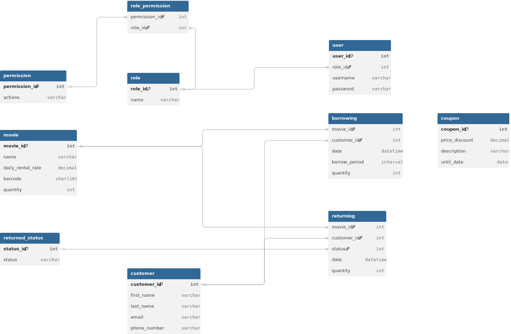

# GROUP BY exercises

## GROUP BY exercise 1
```sql
SELECT
    p."date" AS date,
    pm."name" AS payment_method,
    sum(p.amount) total_payments
FROM
    complete_sql_mastery.payments p
JOIN complete_sql_mastery.payment_methods pm ON
    p.payment_method = pm.payment_method_id
GROUP BY
    p."date" ,
    pm."name"
ORDER BY
    p."date" ASC,
    pm."name" DESC;
```

## Group BY exercise 2
```sql
SELECT
    o.customer_id ,
    sum(ot.quantity * ot.unit_price) AS spent
FROM
    customers c
JOIN orders o ON
    c.customer_id = o.customer_id
JOIN order_items ot ON
    ot.order_id = o.order_id
WHERE
    c.state = 'VA'
GROUP BY
    o.customer_id
HAVING
    sum(ot.quantity * ot.unit_price) > 100;
```

<br>

# ROLLUP exercise
```sql
SELECT
    pm."name" ,
    sum(p.amount) AS total_amount
FROM
    payment_methods pm
JOIN payments p ON
    pm.payment_method_id = p.payment_method
GROUP BY
    ROLLUP(pm."name" );
```

<br>

# Correlative subquery exercise
```sql
SELECT
    *
FROM
    invoices i
WHERE
    i.invoice_total > (
        SELECT
            avg(i2.invoice_total)
        FROM
            invoices i2
        WHERE
            i2.client_id = i.client_id
    )
```    

<br>

# EXISTS query example
```sql
SELECT
    c."name"
FROM
    clients c
WHERE
    EXISTS(SELECT 1
           FROM invoices i 
           WHERE i.client_id = c.client_id);
```

## JOIN alternative
```sql
SELECT
    DISTINCT c."name"
FROM
    clients c
JOIN invoices i ON
    c.client_id = i.client_id;
```

<br>

# EXISTS vs IN query example
```sql
SELECT "name"
FROM clients
WHERE client_id IN (SELECT DISTINCT client_id
                    FROM invoices)
```

## EXISTS alternative
```sql
SELECT c."name" 
FROM clients c
WHERE EXISTS(SELECT 1
             FROM invoices i 
             WHERE i.client_id = c.client_id);
```

<br>

# EXISTS query exercise
```sql
SELECT
    *
FROM
    products p
WHERE
    NOT EXISTS (SELECT
                    1
                FROM
                    order_items oi
                WHERE
                    oi.product_id = p.product_id
    )
```    

<br>

# COALESCE task
```sql
SELECT
    c.first_name || ' ' || c.last_name AS customer,
    COALESCE(c.phone, 'Unknown') AS phone
FROM
    customers c
```

<br>

# CASE example
```sql
SELECT
    o.order_id,
    o.order_date ,
    CASE
        WHEN EXTRACT(YEAR FROM o.order_date) < EXTRACT(YEAR FROM CURRENT_TIMESTAMP) THEN 'Active'
    END AS status
FROM
    orders o
```

<br>

# CASE/IF exercise
```sql
SELECT
    p.product_id,
    p."name" AS name,
    count(oi.product_id) AS orders,
    CASE
        WHEN count(oi.product_id) > 1 THEN 'Many times'
        ELSE 'Once'
    END AS frequency
FROM
    products p
JOIN order_items oi ON
    p.product_id = oi.product_id
GROUP BY
    p.product_id,
    p."name"
ORDER BY
    p.product_id
```

<br>

# VIEW exercise
```sql
CREATE OR REPLACE VIEW client_balance AS
SELECT
    c.client_id ,
    c."name",
    sum(i.invoice_total) - sum(i.payment_total) AS balance
FROM
    clients c
JOIN invoices i
        USING (client_id)
GROUP BY
    c.client_id ,
    c."name";
```

<br>

# Updateble view example
```sql
CREATE OR REPLACE VIEW employees_with_small_salary AS
SELECT *
FROM employees e
WHERE e.salary < 50000;

SELECT * FROM employees_with_small_salary ewss ;
DELETE FROM employees_with_small_salary ;

SELECT * FROM employees e ;
```

<br>

# NOT updatable view example
```sql
CREATE VIEW joined_view AS
SELECT e.employee_id, e.first_name, e.last_name
FROM employees e JOIN offices o ON e.office_id = o.office_id 
WHERE o.office_id < 2;

DELETE FROM joined_view;
```

<br>

# View WITH CHECK OPTION example
```sql
CREATE OR REPLACE VIEW employees_with_small_salary AS
SELECT *
FROM employees e
WHERE e.salary < 50000
WITH CHECK OPTION;

SELECT * FROM employees_with_small_salary ewss ;

-- No error
INSERT INTO employees_with_small_salary
VALUES(1, 'TEST', 'TEST', 'TEST', 10000, 1, 1);

-- Error
INSERT INTO employees_with_small_salary
VALUES(2, 'TEST', 'TEST', 'TEST', 60000, 1, 1);

-- Error
UPDATE employees_with_small_salary 
SET salary = 51000
WHERE employee_id = 1;

-- No error
DELETE FROM employees_with_small_salary
WHERE employee_id = 1;
```

<br>

# Stored procedure example
```sql
CREATE OR REPLACE PROCEDURE update_client (_client_id INTEGER)
LANGUAGE plpgsql
AS $$
BEGIN
    UPDATE clients
    SET name = 'Lukas'
    WHERE _client_id = client_id;
END; $$;
```

<br>

# Parameters validation example
```sql
CREATE OR REPLACE PROCEDURE update_client (_client_id INTEGER)
LANGUAGE plpgsql
AS $$
BEGIN
    IF _client_id <= 0 THEN
        RAISE EXCEPTION 'Invalid client id!'
            USING ERRCODE = '22003',
                  HINT = 'Provide a non-negative integer number.';
    END IF;

    UPDATE clients
    SET name = 'Lukas'
    WHERE _client_id = client_id;
END; $$;

CALL update_client(-1);

-- Output:
-- SQL Error [22003]: ERROR: Invalid client id!
--   Hint: Provide a non-negative integer number.
--   Where: PL/pgSQL function update_client(integer) line 4 at RAISE
```

<br>

# Output parameters example
```sql
CREATE OR REPLACE PROCEDURE get_client_address (_client_id INTEGER, OUT _address TEXT)
LANGUAGE plpgsql
AS $$
BEGIN
    SELECT address INTO _address
    FROM clients
    WHERE client_id = _client_id;
END; $$;

DO $$
DECLARE
    v_address TEXT;
BEGIN
    CALL get_client_address(1, v_address);
    RAISE NOTICE 'Address: %', v_address;
END;
$$;

-- Printed result: "Address: 3 Nevada Parkway"
```

<br>

# Variables

## Session variable example
```sql
SET custom.address = 'Groove street 58';
SELECT current_setting('custom.address');

-- Output: "Groove street 58"
```

## Local variable example
```sql
CREATE OR REPLACE PROCEDURE update_client (_client_id INTEGER)
LANGUAGE plpgsql
AS $$
DECLARE
    _address TEXT := '';
BEGIN
    SELECT address INTO _address
    FROM clients
    WHERE client_id = _client_id;

    RAISE NOTICE 'Address: %', _address;
END; $$;

CALL update_client(2);

-- Output: "34267 Glendale Parkway"
```

<br>

# Function example
```sql
-- Return type: TEXT
CREATE OR REPLACE FUNCTION get_client_address (_client_id INTEGER)
RETURNS TEXT
LANGUAGE plpgsql
AS $$
DECLARE
    _address TEXT := '';
BEGIN
    SELECT address INTO _address
    FROM clients
    WHERE client_id = _client_id;

    RETURN _address;
END; $$;

SELECT * FROM get_client_address(5);

-- Output: "0863 Farmco Road"

-- Return type: TABLE
CREATE OR REPLACE FUNCTION get_client_address (_client_id INTEGER)
RETURNS TABLE(name VARCHAR(50), address VARCHAR(50))
LANGUAGE plpgsql
AS $$
DECLARE
    _address TEXT := '';
BEGIN
    RETURN QUERY
    SELECT c.name, c.address
    FROM clients c
    WHERE c.client_id = _client_id;
END; $$;

SELECT * FROM get_client_address(2);

-- Output: | name  |        address         |
--         | Lukas | 34267 Glendale Parkway |
```

<br>

# Triggers

## Trigger example
```sql
CREATE OR REPLACE FUNCTION update_payment_total_on_payment_insert()
RETURNS TRIGGER
LANGUAGE plpgsql
AS $$
BEGIN
    UPDATE invoices
    SET payment_total = payment_total + NEW.amount
    WHERE invoice_id = NEW.invoice_id 
        AND client_id = NEW.client_id;

    RETURN NEW;
END; $$;

CREATE TRIGGER payments_after_insert
AFTER INSERT ON payments
FOR EACH ROW
EXECUTE FUNCTION update_payment_total_on_payment_insert();
```

## Trigger task
```sql
CREATE OR REPLACE FUNCTION decrease_payments_total_after_payment_delete()
RETURNS TRIGGER
LANGUAGE plpgsql AS $$
BEGIN
    update invoices
    set payment_total = payment_total - OLD.amount
    WHERE invoice_id = OLD.invoice_id 
        AND client_id = OLD.client_id;

    RETURN OLD;
END; $$;

CREATE OR REPLACE TRIGGER invoices_after_delete
AFTER DELETE ON payments
FOR EACH ROW
EXECUTE FUNCTION decrease_payments_total_after_payment_delete();
```

<br>

# Transaction examples

## Transaction example 1
```sql
START TRANSACTION;

INSERT INTO orders (order_id, customer_id, order_date, status)
VALUES (11, 1, '2019-01-01', 1);

INSERT INTO order_items
VALUES (11, 1, 1, 1);

COMMIT;
```

## Transaction rollback example
```sql
START TRANSACTION;

This change will be rolled back
INSERT INTO orders (order_id, customer_id, order_date, status)
VALUES (13, 1, '2019-01-01', 1);

DO $$
BEGIN
    RAISE EXCEPTION 'Test!';
END $$;

INSERT INTO order_items
VALUES (13, 1, 1, 1);

COMMIT;
```

## Concurrent transactions block example
```sql
-- Open below code in 2 code editors/SQL scripts windows in DBeaver
START TRANSACTION;         -- 1
                           -- 2
UPDATE customers           -- 3
SET points = points + 10   -- 4
WHERE points < 800;        -- 5
                           -- 6
COMMIT;                    -- 7

-- Execute in 1-st editor first line, then 3-rd line
-- Execute in 2-nd editor first line, then 3-rd line
-- See that execution in 2-nd editor is blocked and loading circle is rotating

-- Commit transaction in the 1-st editor and see that execution in the 2-nd editor gets unblocked
-- Commit transaction in the 2-nd editor and see that both results are committed and reflected
```

## Concurrent problems: `Lost update` example
```sql
Transactions:
T1, T2

Flow:
1. T1 begins
2. T2 begins
3. T1 reads column "balance" with value 1000
4. T2 read column "balance" with value 1000
5. T1 removes 100 from the read amount
6. T1 is committed
7. "balance" value is now 900
8. T2 adds 100 to the read amount (1000)
9. T2 is committed
10. "balance" value is now 1100

Problems:
1. The result from the T1 is ignored
2. The final value of the "balance" is not correct
3. Transactions are not isolated

Solution:
Provide lock mechanism, so only one transaction can manipulate some certain data while others will wait its end
```

## Concurrent problems: `Dirty read` example
```sql
Transactions:
T1, T2

Flow:
1. T1 begins
2. T1 reads column "balance" with value 1000
3. T1 removes 100 from the read amount
4. T2 begins
5. T2 reads column "balance" with value 900 that is not committed by the T1 YET !!!
6. T1 rollbacks
7. T2 removes 200 from the read amount (900 instead of 1000)
8. T2 is committed
9. "balance" value is now 700 (instead of 800)

Problems:
1. T2 reads data that is not yet persisted/saved to the table
2. The calculations at the end of the day of T2 are incorrect and are unexpected

Solutions:
1. Set transaction isolation level to the READ_COMMITTED
```

## Concurrent problems: `Non-repeatable read` example
```sql
Transactions:
T1, T2

Flow:
1. T1 begins
2. T2 begins
3. T1 reads column "balance" with value 1000
4. T2 read column "balance" with value 1000
5. T1 removes 100 from the read amount
6. T1 is committed
7. "balance" value is now 900
8. T2 reads column "balance" with value 900
9. T2 is committed

Problems:
1. T2 selects different values of the "balance" column within the same transaction. No repeatable reads

Solution
1. Set transaction isolation level to the REPEATABLE_READ
=> Transaction will operate with the same snapshot of the data even if the data was changed by another transaction
```

## Concurrent problems: `Phantom read` example
```sql
Transactions:
T1, T2

Flow:
1. T1 begins
2. T2 begins
3. T2 updated customers table and added one more customer with "balance" = 600
4. T1 retrieves all the customers with "balance" > 500
5. T1 make some update based on the retrieved data at the start
6. T2 is committed
7. T1 is committed
8. T2 inserted customer will not be updated by the T1 even though it satisfies the criteria because it was inserted AFTER the update process (basically because the transaction T2 COMMIT was after T1 modifications)

Problems:
1. T1 "ghosted" newly added customer with "balance" = 600 by T2 and to this customer was not performed any actions

Solution:
1. Set transaction isolation level to the SERIALIZABLE
=> This way T1 will be aware that T2 is changing data that can influence its result and will wait till T2 commit and ONLY after that T1 will do its job and perform its query selecting all the possible records for the criteria

Additional thoughts:
1. If want to update all the customer with "balance" > 500 and some records were added, then we simply can execute one more time an update
2. But if it is critical for us within one transaction to update all the customers with stated criteria, then SERIALIZABLE is need that will lower the concurrency significantly and will execute transaction like sequentially: one after another, although will guarantee lack of any anomalies for the transactions 
```

## Deadlock example
```sql
-- First connection
START TRANSACTION;

UPDATE customers
SET first_name = 'TEST'
WHERE customer_id = 1;

UPDATE offices
SET address = 'TEST'
WHERE office_id = 2;

COMMIT;

--------------------

-- Second connection
START TRANSACTION;

UPDATE offices
SET address = 'TEST'
WHERE office_id = 2;

UPDATE customers
SET first_name = 'TEST'
WHERE customer_id = 1;

COMMIT;

-- UPDATE clause locks certain rows until the end of the operation/transaction.
-- Both transaction do have the same queries but in reverse order, then first will wait for the second
-- and the second will wait for the first.

-- Error: SQL Error [40P01]: ERROR: deadlock detected
--   Detail: Process 226 waits for ShareLock on transaction 977; blocked by process 39.
-- Process 39 waits for ShareLock on transaction 978; blocked by process 226.
--   Hint: See server log for query details.
--   Where: while updating tuple (0,1) in relation "customers"
```

<br>

# JSON operations example
```sql
--Basic operations with JSON:
--1. Save JSON
--2. Access column of type JSON
--3. Access JSON as TEXT
--4. Check existence of the key
--5. Access array from JSON 
--6. Access subelement

ALTER TABLE products
ADD COLUMN description JSON;

-- 1
UPDATE products p 
SET description = '{"obj": {"name": "test"}, "status": ["first", "second"]}'
WHERE product_id = 1;

-- 2
SELECT description -> 'obj'
FROM products p
WHERE product_id = 1;

-- 3
SELECT description ->> 'obj'
FROM products p
WHERE product_id = 1;

-- 6
SELECT description -> 'obj' ->> 'name'
FROM products p
WHERE product_id = 1;

-- 5
SELECT description -> 'status' ->>0
FROM products p
WHERE product_id = 1;

-- 4
Only for the JSONB works
SELECT (description -> 'obj')::JSONB ? 'name'
FROM products p
WHERE product_id = 1;

-- Index on certain column field
CREATE INDEX idx_name ON products ((description -> 'obj' ->> 'name'))

-- Another existence operator that accepts JSON
SELECT *
FROM products p
WHERE description::jsonb @> '{"obj": {"name": "test"}}';

-- Map array elements as row results
SELECT jsonb_array_elements((description -> 'status')::jsonb)
FROM products p
WHERE description::jsonb @> '{"obj": {"name": "test"}}';

-- Builds JSON data type from the values
SELECT json_build_object('name', 'test', 'age', 12);
```

<br>

# `Primary key` example
```sql
CREATE TABLE test_table (
    id integer PRIMARY KEY GENERATED ALWAYS AS IDENTITY,
    name varchar DEFAULT '',
    age smallint
);
```

<br>

# `Foreign key` examples

## Foreign key declaration when creating table
```sql
CREATE TABLE parent (
    id integer PRIMARY KEY GENERATED ALWAYS AS IDENTITY,
    name varchar DEFAULT '',
    age smallint
);


CREATE TABLE child (
    id serial PRIMARY KEY, -- Legacy data type
    parent_id integer,
    name varchar DEFAULT '',
    age SMALLINT,
    CONSTRAINT fk_parent FOREIGN KEY (parent_id) REFERENCES parent(id)
);

-- Drop constraint
ALTER TABLE child
DROP CONSTRAINT fk_parent;

-- Adding FK after table creation
ALTER TABLE child
ADD CONSTRAINT fk_parent FOREIGN KEY (parent_id) REFERENCES parent(id);
```

## Foreign key constraints example
```sql
CREATE TABLE parent (
    id integer PRIMARY KEY GENERATED ALWAYS AS IDENTITY,
    name varchar DEFAULT '',
    age smallint
);

CREATE TABLE child (
    id serial PRIMARY KEY, -- Legacy data type
    parent_id integer,
    name varchar DEFAULT '',
    age SMALLINT
);

-- Adding FK constraints after table creation
ALTER TABLE child
ADD CONSTRAINT fk_parent FOREIGN KEY (parent_id) REFERENCES parent(id) ON UPDATE CASCADE ON DELETE RESTRICT;

INSERT INTO parent
VALUES (DEFAULT, 'Mark', 18);

INSERT INTO child
VALUES (DEFAULT, 1, 'Zayn', 1);

-- Will not allow: Error
DELETE FROM parent
WHERE id = 1;

-- ON UPDATE is useful when referenced parent column is NOT a PK, since PK cannot be changed
```

<br>

# Normalization examples

## 1-st normal form
```sql
-- Breaking the 1-st normal form
CREATE TABLE courses (
    course_id integer PRIMARY KEY GENERATED ALWAYS AS IDENTITY,
    title varchar(255),
    price decimal(5, 2),
    instructor varchar(255),
    tags varchar(255)
);

----------------------

-- Solution #1

-- This is a bad design
CREATE TABLE tags (
    tag_id integer PRIMARY KEY GENERATED ALWAYS AS IDENTITY,
    course_id integer REFERENCES courses(course_id),
    name varchar(255)
);
-- Suppose that one tag can be obtained by many courses. Then that tag should be created X times equal to the quantity of courses obtaining it. Too many duplicated rows in some sort

----------------------

-- Solution #2

-- Better design: using Join table
CREATE TABLE tags (
    tag_id integer PRIMARY KEY GENERATED ALWAYS AS IDENTITY,
    name varchar(255)
);

CREATE TABLE courses_tags (
    course_id integer REFERENCES courses(course_id),
    tag_id integer REFERENCES tags(tag_id),
    CONSTRAINT pk_course_tags PRIMARY KEY(course_id, tag_id)
);

ALTER TABLE courses
DROP COLUMN tags;
```

## 2-nd normal form
```sql
-- Is violating 2-nd normal form
CREATE TABLE courses (
    course_id integer PRIMARY KEY GENERATED ALWAYS AS IDENTITY,
    title varchar(255),
    price decimal(5, 2),
    instructor varchar(255)
);

----------------------

-- Solution

CREATE TABLE instructors (
    instructor_id integer PRIMARY KEY GENERATED ALWAYS AS IDENTITY,
    name varchar(255)
);

ALTER TABLE instructors
ADD CONSTRAINT fk_instructors_courses FOREIGN KEY(instructor_id) REFERENCES courses(course_id);

ALTER TABLE courses
DROP COLUMN instructor;
```

## 3-rd normal form
```sql
-- Violates 3-rd normal form
CREATE TABLE invoices (
    invoice_id int NOT NULL PRIMARY KEY,
    client_id int4 NOT NULL,
    invoice_total numeric(9, 2) NOT NULL,
    payment_total numeric(9, 2) DEFAULT 0.00 NOT NULL,
    balance NUMERIC(9, 2) NOT NULL, -- balance = invoice_total - payment_total
    invoice_date date NOT NULL,
    due_date date NOT NULL,
    payment_date date NULL,
);
-- Problem: invoice_total or/and payment_total changes and therefore balance should be updated

-- Violates 3-d normal form
CREATE TABLE people (
    first_name varchar(255),
    last_name varchar(255),
    full_name varchar(255) -- full_name = first_name + last_name
);
-- Problem: first_name or/and last_name changes and therefore full_name should be updated

----------------------

-- Solution

CREATE TABLE invoices (
    invoice_id int NOT NULL PRIMARY KEY,
    client_id int4 NOT NULL,
    invoice_total numeric(9, 2) NOT NULL,
    payment_total numeric(9, 2) DEFAULT 0.00 NOT NULL,
    invoice_date date NOT NULL,
    due_date date NOT NULL,
    payment_date date NULL,
);

CREATE TABLE people (
    first_name varchar(255),
    last_name varchar(255),
);
```

# DB modeling tasks

# Project "Flight booking system"

[Flight Booking System requirements](../file/Flight%20Booking%20System.pdf)


# Project "Vidly"

[Vidly requirements](../file/Vidly.pdf)



# Indexes

## Index example 1
```sql
-- Use EXPLAIN ANALYZE in PostgreSQL since it's giving more detailed report.

-- Without index
EXPLAIN SELECT *
FROM customers
WHERE state = 'CA';
-- Aggregate  (cost=51.70..51.70 rows=1 width=8)
--  ->  Seq Scan on customers  (cost=0.00..51.14 rows=223 width=0)

CREATE INDEX idx_state ON customers(state);

-- With index
EXPLAIN SELECT *
FROM customers
WHERE state = 'CA';
-- Aggregate  (cost=8.74..8.75 rows=1 width=8)
--  ->  Index Only Scan using idx_state on customers  (cost=0.28..8.18 rows=223 width=0)
```

## Index task 1
```sql
CREATE INDEX IF NOT EXISTS idx_points ON customers(points);

EXPLAIN SELECT *
FROM customers
WHERE points > 1000;
```